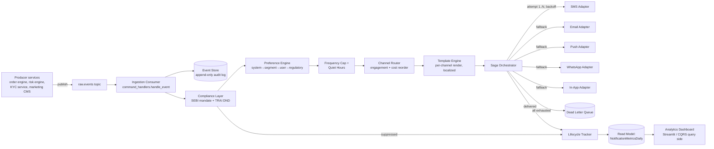
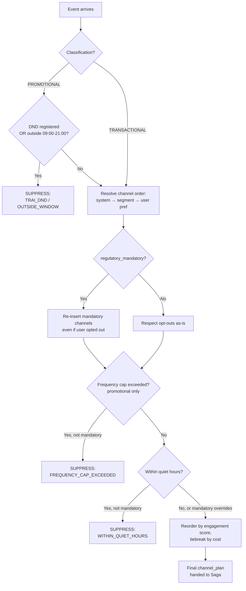
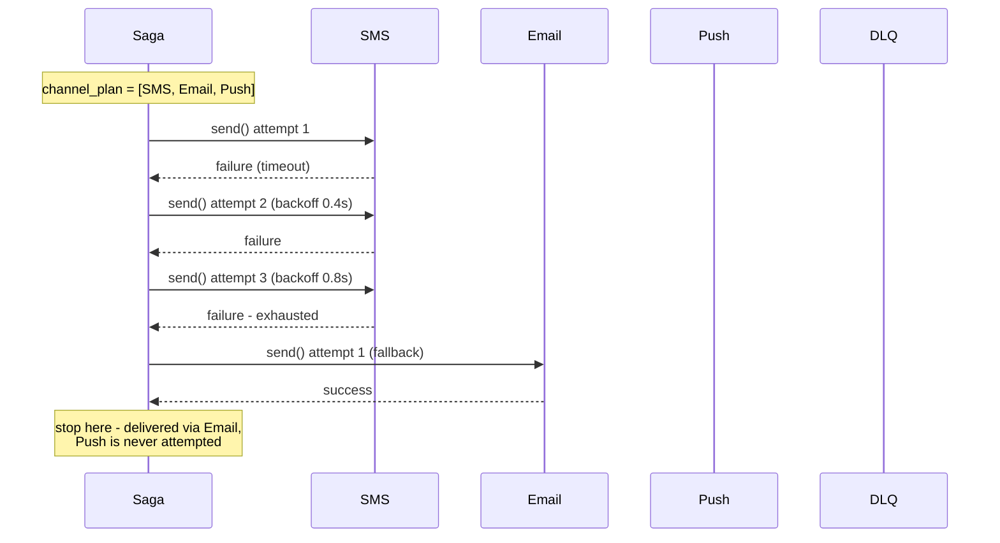
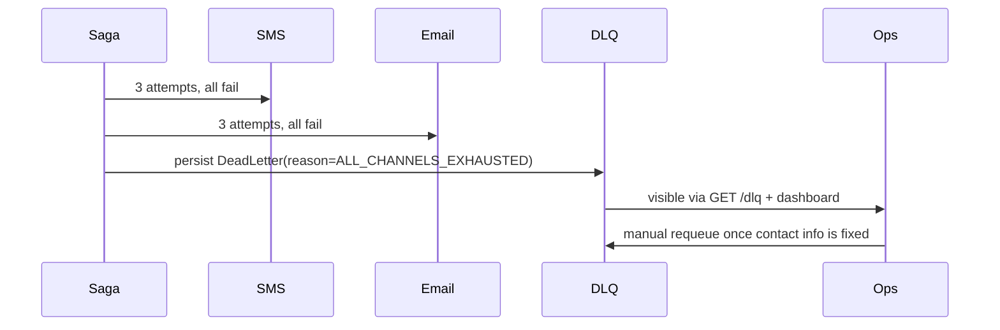

# Architecture

## 1. End-to-end event-driven flow

## 2. Channel routing decision tree

This is the exact precedence order implemented in `app/routing/router.py`,
matching the brief's requirement: regulatory mandates are non-negotiable,
then user preference, then delivery optimisation, then cost.

## 3. Saga: multi-channel retry & DLQ handling

If **every** channel in the plan exhausts its retries (as in the SMS+Email
both-fail case), the notification is dead-lettered instead of dropped:

## 4. Why each pattern earns its place (not just buzzword compliance)

**Event Sourcing.** The raw event is durably persisted in `event_store`
*before* any compliance or routing decision runs. If a bug in the
compliance layer is later found and fixed, every past event can be
replayed through the corrected logic — essential for a regulated system
where "what did we actually tell this user, and why" must be
reconstructable months later for an audit.

**CQRS.** `command_handlers.py` (write) and `query_handlers.py` (read)
never share a code path. Ingestion writes to narrow, heavily-indexed
tables (`notifications`, `delivery_attempts`); the dashboard reads from a
separate, pre-aggregated `notification_metrics_daily` table. This means
an analyst running a slow dashboard query during market hours cannot
contend for locks with the live ingestion pipeline — a real failure mode
in naive designs where dashboards `SELECT COUNT(*)` straight off the
transactional table.

**Saga.** Multi-channel delivery is a sequence of independently-retryable
steps with a clear "what happens if this whole sequence fails" answer
(dead-letter, don't drop). A plain try/except around a single send call
can't express "retry SMS 3x, then *try Email instead*, then *try Push
instead*" — that's inherently a stateful, multi-step process, which is
exactly what the Saga pattern formalizes.

**Dead Letter Queue.** Silently dropping a notification after every
channel fails is unacceptable when the content might be a margin call.
The DLQ guarantees nothing vanishes — it's either delivered, suppressed
*with an audited reason*, or dead-lettered *with an audited reason and a
requeue path*.

**Kafka-shaped event bus (simulated here).** Partitioning by `user_id`
(documented in `app/event_bus.py`) keeps all events for one user ordered
relative to each other while allowing massive horizontal scale across
users — the standard approach for getting both throughput and per-entity
ordering guarantees in a high-volume system (target: millions of
events/day).

## 5. Scalability notes for a real deployment

- **Ingestion**: multiple consumer-group instances of `handle_event`,
  partitioned by `user_id` on the `raw.events` Kafka topic. Linear
  horizontal scale.
- **Channel adapters**: each channel adapter should be its own
  rate-limited worker pool — provider rate limits (e.g. WhatsApp Business
  API tiers) differ per channel and must not block other channels.
- **Read model**: `notification_metrics_daily` can be refreshed by a
  separate, lagging consumer group with no impact on ingestion SLAs;
  acceptable staleness for a dashboard is seconds-to-minutes, not
  milliseconds.
- **DLQ sweep**: a scheduled job (not implemented here, noted in the
  runbook) should periodically attempt requeue for dead-lettered
  notifications where contact info has since been corrected.
